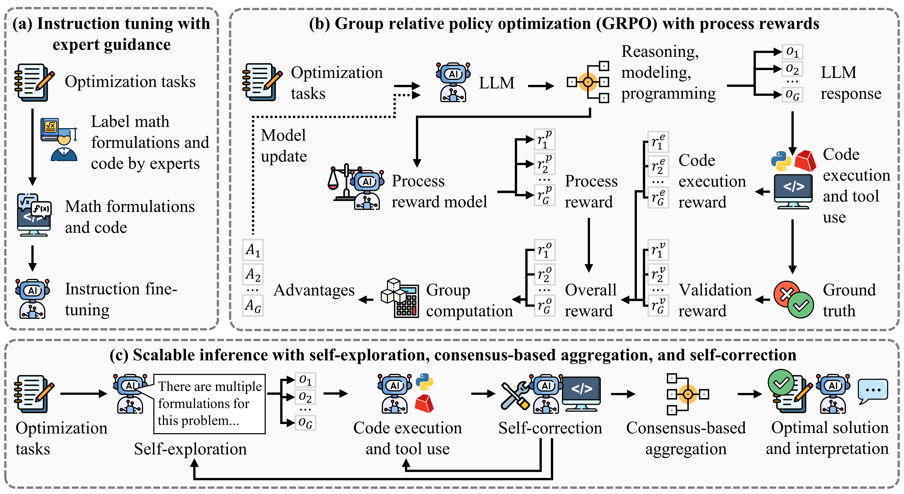

# PRIMO: Process-rewarded Reasoning LLM for Optimization

<p align="center">
  
</p>

PRIMO turns a natural-language optimization problem into a correct, executable
Gurobi program. It is trained in three stages, shown above:

- **(a) Expert-guided SFT** on OR problems labeled with formulations and code.
- **(b) GRPO with dense, verifiable rewards** — process + code-execution + validation.
- **(c) Scalable inference** — self-exploration, self-correction, and consensus voting.

**Benchmarks:** IndustryOR, LogiOR, Mamo (easy / complex), NL4Opt,
NLP4LP, OptiBench — as both `*.json` and `train/test/all.parquet` splits.

## Model
Model can be downloaded at: https://huggingface.co/lyvekerr/PRIMO

## Quick start

```bash
# 1. Pull a training image (see docker/ for the full matrix)
docker pull verlai/verl:vllm011.latest

# 2. Install runtime deps (or use the image above)
pip install vllm gurobipy numpy pandas pyarrow   # + a Gurobi license

# 3. Evaluate with majority vote (stage c)
cd release/code
python evaluation_with_majority_vote.py \
```

The VERL-compatible `compute_score` in `code/reward_function.py` fuses the three
reward channels.

> Note: `reward_function.py` expects a `test_prm_api` module that queries your
> Process Reward Model; plug in PRM before training.

```

Built on [VERL](https://github.com/volcengine/verl), [LlamaFactory](https://github.com/hiyouga/LlamaFactory) and
[vLLM](https://github.com/vllm-project/vllm).

